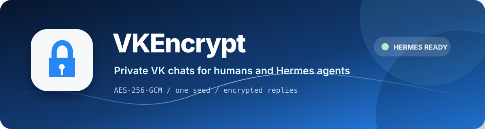

# VKEncrypt



**Private VK chats for humans and Hermes agents.** AES-256-GCM, one shared seed,
automatic reply encryption, emoji/Cyrillic transports, and long-message
assembly. The key stays local; VK sees only ciphertext.

[Install in Tampermonkey](https://raw.githubusercontent.com/megamen32/VKCipher/main/extension/vkencrypt.user.js) ·
[Install Hermes adapter](https://raw.githubusercontent.com/megamen32/VKCipher/main/scripts/install-hermes-vk-plugin.sh) ·
[GitHub](https://github.com/megamen32/VKCipher)

## 30 seconds

### Browser

1. Install [Tampermonkey](https://www.tampermonkey.net/).
2. Open **[Install VKEncrypt](https://raw.githubusercontent.com/megamen32/VKCipher/main/extension/vkencrypt.user.js)**.
3. Open a VK chat and create one seed phrase. Enter the same seed on every device.

### Hermes

This is the **VKCipher adapter**, not the upstream `web3blind/hermes-vk-platform`.
It lives in [`integrations/hermes-vk-platform`](integrations/hermes-vk-platform/)
and installs to `~/.hermes/plugins/vk`.

Install from any Bash shell:

```bash
bash <(curl -fsSL https://raw.githubusercontent.com/megamen32/VKCipher/main/scripts/install-hermes-vk-plugin.sh)
```

Configure the VK community once, then set the same seed without opening Hermes UI:

```bash
hermes gateway setup
bash <(curl -fsSL https://raw.githubusercontent.com/megamen32/VKCipher/main/scripts/hermes-vk-key.sh) set-seed --restart
```

The seed prompt is hidden. To rotate to a direct 64-hex key:

```bash
bash <(curl -fsSL https://raw.githubusercontent.com/megamen32/VKCipher/main/scripts/hermes-vk-key.sh) set-key --restart
```

Key rotation is immediate after the restart, but old messages require the old
seed/key. Never paste a seed into a public chat or commit it to Git.

## What works

- VK `vk.com`, `vk.ru`, and `web.vk.me` userscript.
- Hermes VK community bot with encrypted inbound and outbound text.
- Emoji, Base64, and experimental Russian-word transports.
- Long encrypted messages split and reassembled automatically.
- Per-chat key selection in the browser; per-peer encrypted sessions in Hermes.
- Voice and encrypted file flows in the browser adapter.

## Security model

The browser and Hermes derive compatible AES-256-GCM keys from the same seed
using PBKDF2-SHA256. Hermes fails closed for plaintext when an encrypted peer
session is required. This project is not independently audited; protect the
seed like a password and verify the code before using it for sensitive traffic.

## Links

- [Hermes adapter README](integrations/hermes-vk-platform/README.md)
- [Hermes key manager](scripts/hermes-vk-key.sh)
- [Browser extension details](extension/README.md)
- [Russian dictionary and format](extension/dictionaries/README.md)
- [Technical crypto notes](TECHNICAL.md)
- [Bot middleware](bot/README.md)
- [Chrome/Firefox/Safari builds](extension/README.md)

## Development

```bash
npm install
npm run build
npm test:middleware
node --test tests/hermes-installers.test.mjs
```

## License

[MIT](LICENSE)
